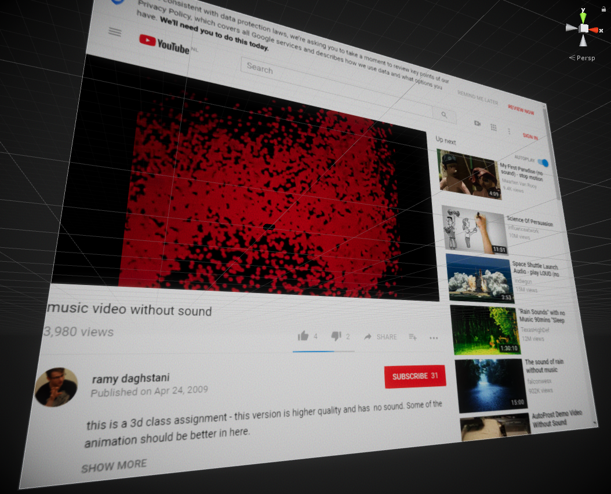
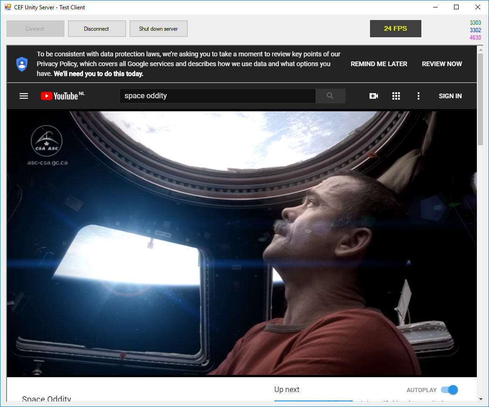
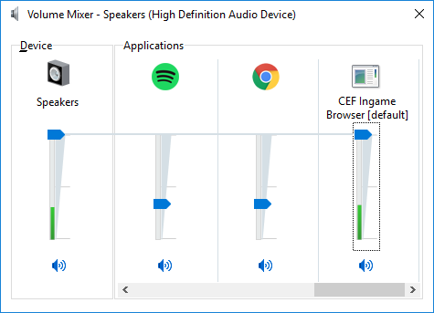

# chromium-unity-server

**Proxy server for an embedded Chromium browser in your Unity games.**

🚧 This is a work in progress, do not use this 🚧

🚧 This is a work in progress, do not use this 🚧

## Features

- Use all the modern web features in Chromium.
- Fast data exchange via named pipes, making high FPS possible.
- Pass mouse and keyboard events from game to browser.
- Input support for key combinations and gestures like dragging and selecting.
- Bi-directional messaging between your C# code and in-browser JavaScript code.

The project consists of two parts: First, the server, which manages a CEF (Chrome Embedded Framework) browser instance.
Second, a .NET library for integration in Unity or other applications, which communicates with the server via named pipe.

A test client is also available (see below).

## Requirements

***Currently* only targets Windows.** Mono support is possible in the underlying libraries and APIs, so Linux and Mac support is possible with some additional work.

.NET 4.x scripting compatibility is required, you will **need to enable the "Expirimental" scripting engine** for your unity project. The legacy / stable scripting engine will not work, as it does *not* support named pipes.

**Only 64-bit architectures** are supported. If you are looking for x86 support, this project is not for you.

## Test client

The test client project is also bundled in the solution. It is not required, but can be used to test / debug the CEF Server away from your game.

## Usage notes

### Audio playback

Audio playback that occurs in the browser (for example, when playing a YouTube video) is not played in game / in engine. Instead, it is played on the separate browser process. That means it has its own, separate volume control and cannot be used to produce 3D audio.

The name of the executable will be set to "CEF Ingame Browser" so that users can identify the audio source in their volume mixer, as seen below.

